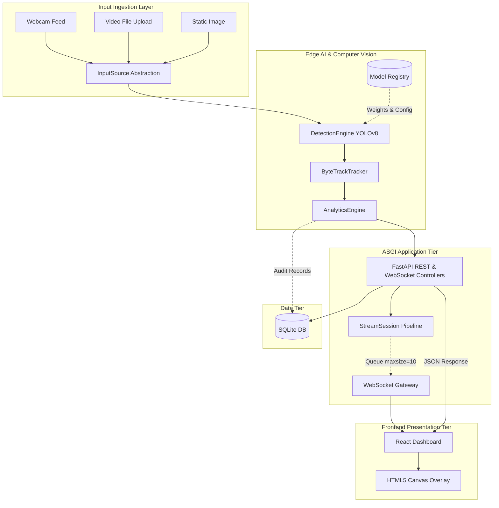
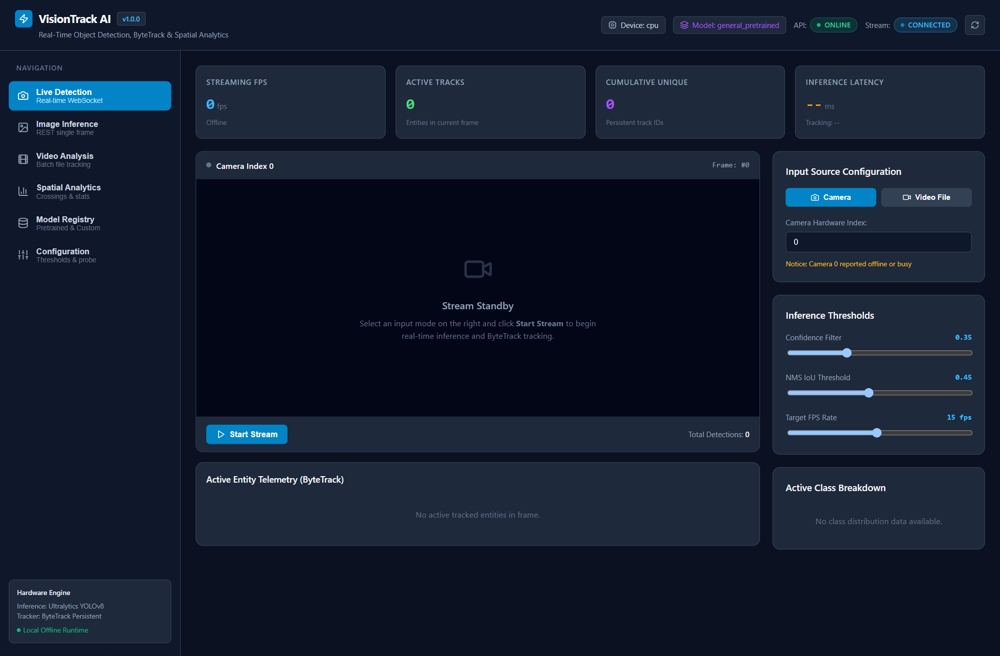
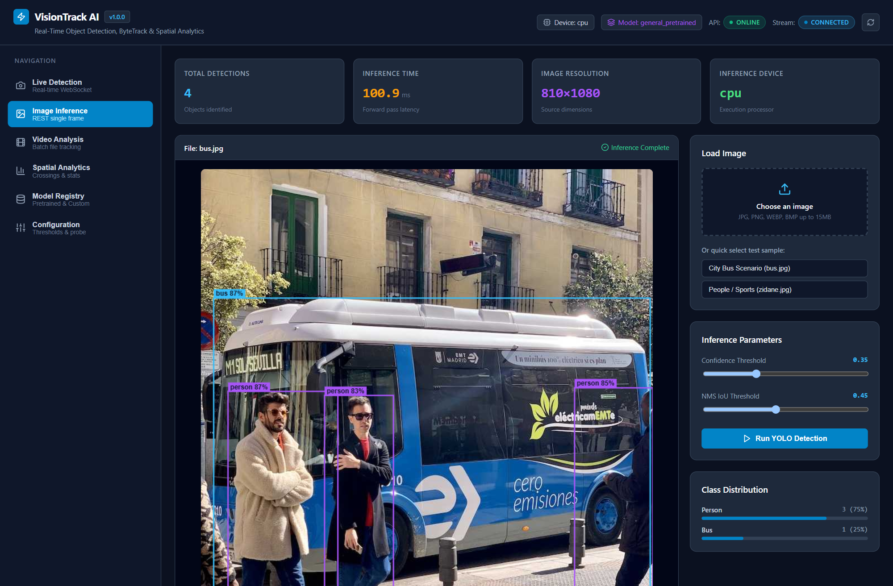
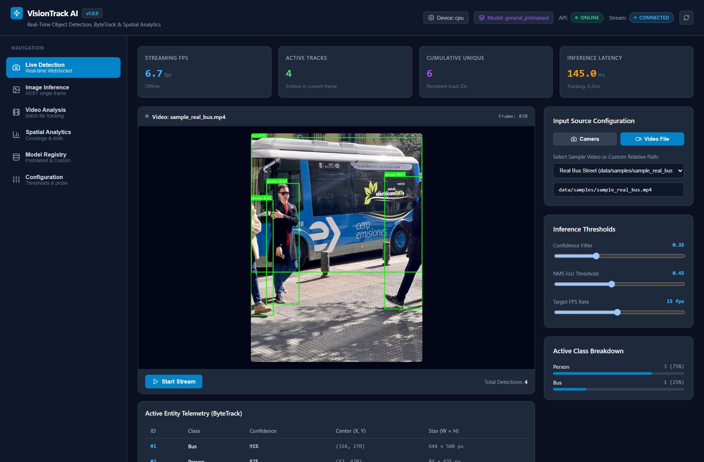
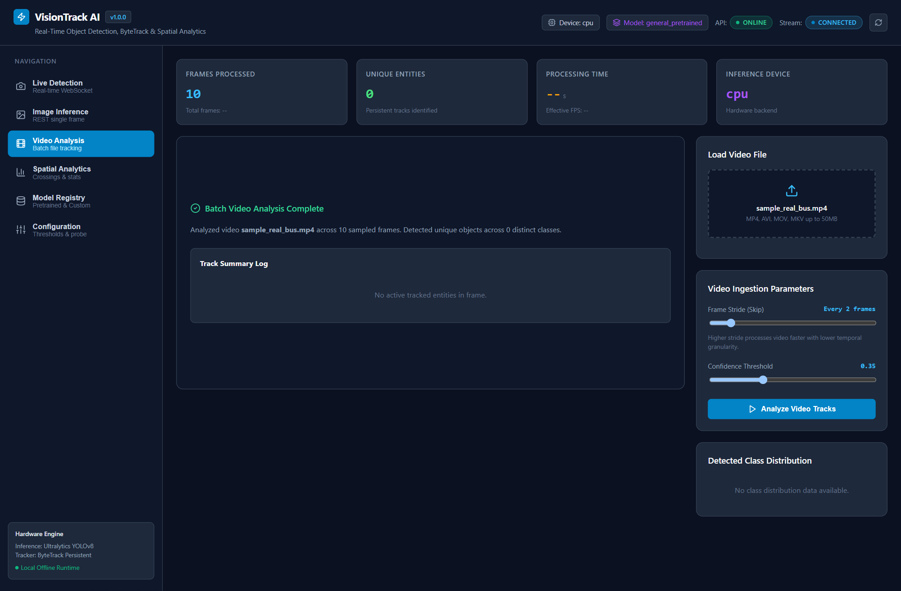
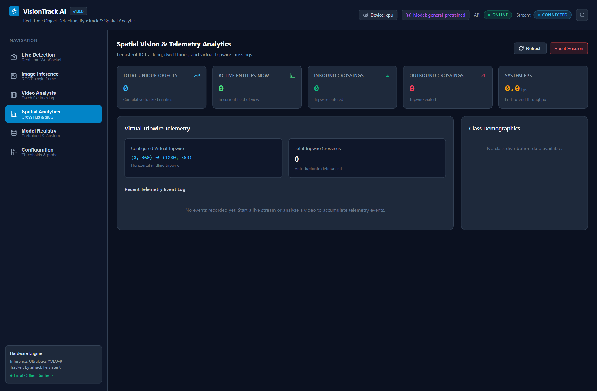
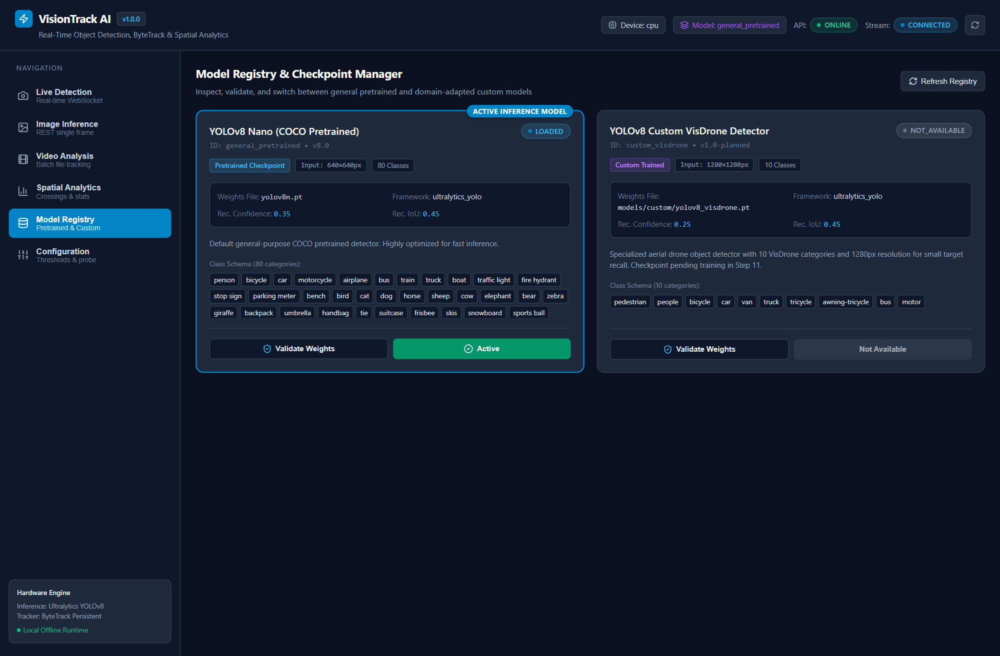
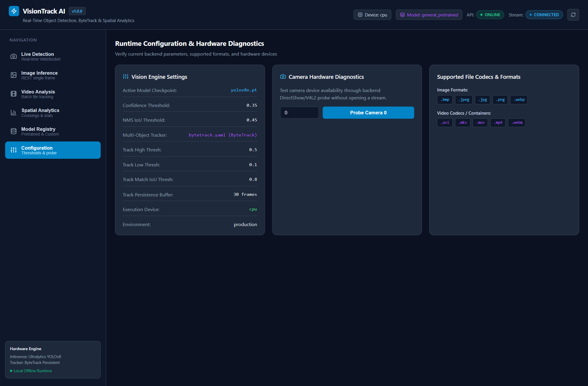

# Real-Time Object Detection, Multi-Object Tracking & Video Analytics Platform

[](https://www.python.org/)
[](https://fastapi.tiangolo.com/)
[](https://react.dev/)
[](https://vitejs.dev/)
[](https://pytorch.org/)
[](https://docs.ultralytics.com/)
[](https://opencv.org/)
[](https://www.sqlite.org/)
[](https://www.docker.com/)
[](https://docs.pytest.org/)
[](LICENSE.md)

A production-oriented real-time computer vision and video analytics platform that unifies high-throughput edge AI inference (YOLOv8 + ByteTrack), an asynchronous ASGI backend (FastAPI), persistent state auditing (SQLite / SQLAlchemy 2.0), bidirectional WebSocket streaming, and a responsive React single-page dashboard.

---

## 1. Project Overview

Modern video surveillance and edge analytics systems require processing continuous video streams with sub-50ms latency while maintaining spatial state across frames (persistent entity tracking) and computing real-time business telemetry (line crossing, dwell times, and class distributions).

This platform solves that engineering challenge by cleanly decoupling:
1. **Low-Level Media Ingestion:** Context-managed acquisition from hardware cameras, video files, and high-resolution images.
2. **Accelerated Neural Inference:** Tensor Core FP16 YOLOv8 evaluation with single-copy PCIe host-device transfers.
3. **Temporal Data Association:** Two-stage ByteTrack tracking recovering occluded targets with $O(1)$ trajectory ring buffers.
4. **Spatial Analytics:** 2D vector cross-product geometry calculating directional virtual tripwire crossings in memory.
5. **Bidirectional WebSocket Gateway:** Asynchronous streaming with bounded queue backpressure protection and frame-level telemetry.
6. **Frontend Presentation Tier:** React 18 single-page application rendering real-time bounding box canvases and live statistics without DOM bottlenecks.

---

## 2. Key Features

- **Multi-Source Ingestion:** Ingests live hardware webcams via OpenCV DirectShow, pre-recorded video files (`.mp4`, `.avi`, `.mov`, `.mkv`), and static images.
- **Hardware-Accelerated Inference:** Auto-selects NVIDIA CUDA with native FP16 quantization (`13.52 ms` mean inference) or falls back gracefully to CPU (`torch.inference_mode()`).
- **Persistent Object Tracking:** ByteTrack multi-object tracker matches high-confidence targets first and recovers low-confidence occluded targets, maintaining persistent IDs across missed frames.
- **Spatial Line-Crossing Tripwires:** 2D scalar cross-product geometry resolves bidirectional (Forward/Backward) boundary events.
- **Bi-Directional WebSocket Protocol:** Stream session manager with client commands (`start`, `stop`, `pause`, `resume`, `ping`) and backpressure drop policies.
- **Declarative Model Registry:** YAML catalog supporting dynamic runtime model hot-switching without restarting application workers.
- **Production Security Hardening:** Path traversal sanitation (`resolve_safe_path`), 15 MB/50 MB upload limits, 8192px decompression bomb defense, and non-root Docker security.
- **Multi-Container Stack:** Production-ready backend (`python:3.11-slim`) and multi-stage frontend (`nginx:1.27-alpine`) with reverse proxy routing and D: drive storage isolation.
- **Comprehensive Quality Assurance:** 182 backend pytest tests, 12 frontend unit tests, 7 security smoke tests, and automated resource leak verification.

---

## 3. System Architecture



For complete architectural details, see [docs/ARCHITECTURE.md](docs/ARCHITECTURE.md).

---

## 4. Technology Stack

| Domain | Technology | Version | Purpose |
| :--- | :--- | :--- | :--- |
| **Backend Framework** | FastAPI | 0.141.1 | High-performance asynchronous REST & WebSocket controllers |
| **ASGI Web Server** | Uvicorn (Standard) | 0.53.0 | Production ASGI event loop with uvloop / httptools |
| **Deep Learning** | PyTorch (CUDA 12.4) | 2.6.0+cu124 | Neural tensor execution with Tensor Core acceleration |
| **Object Detection** | Ultralytics YOLOv8 | 8.4.161 | Real-time single-stage anchor-free object detector |
| **Object Tracking** | ByteTrack | Built-in | Two-stage IoU Kalman tracking with persistent IDs |
| **Computer Vision** | OpenCV | 4.10.0 / 5.0.0 | DirectShow video decoding, image transforms, JPEG encoding |
| **Persistence Tier** | SQLAlchemy & SQLite | 2.0.54 | Relational session logging and audit persistence |
| **Configuration** | Pydantic Settings | 2.15.0 | Type-safe environment validation and path canonicalization |
| **Frontend Framework**| React 18 + Vite | 18.3.1 / 5.4.10| Responsive single-page application dashboard |
| **Web Server / Proxy** | Nginx | 1.27-alpine | Reverse proxy for REST, WebSockets, and SPA static hosting |
| **Containerization** | Docker & Compose | 29.8.0 / 5.5.1 | Multi-container reproducible deployment stack |

---

## Screenshots

### Dashboard & Live Detection

*Real-time streaming dashboard with camera/video source controls, latency metrics, and ByteTrack telemetry.*

### Real-Time Object Detection

*High-resolution single-frame inference on city street scenario (`bus.jpg`), displaying detected bounding boxes, class labels, confidence scores, and entity distribution.*

### Multi-Object Tracking

*Real-time video tracking over WebSocket showing persistent entity IDs (`#1 Bus 91%`, `#2 Person 82%`), center coordinates, and spatial bounding boxes.*

### Video Detection & Tracking

*Offline video file ingestion and tracking workspace with sampled frame processing and track summary logs.*

### Analytics & Spatial Telemetry

*Spatial telemetry dashboard displaying virtual line tripwire crossings (inbound/outbound), directional breakdown, and event auditing.*

### Model Registry & Checkpoint Manager

*Declarative Model Registry view showing active pretrained YOLOv8 Nano weights and custom domain-adapted VisDrone detector specifications.*

### Docker Runtime Diagnostics

*Production container configuration showing hardware parameters, camera device probe diagnostics, and supported media codecs.*

---

## 5. Supported Input Sources

The `InputSource` abstraction (`backend/app/services/vision/input_sources.py`) provides context-managed ingestion:
- **`ImageInput`:** Ingests `.jpg`, `.jpeg`, `.png`, `.webp`, `.bmp`, and NumPy matrices. Validates pixel dimensions against decompression bomb thresholds (max 8192px).
- **`VideoInput`:** Sequential frame iteration across `.mp4`, `.avi`, `.mov`, `.mkv`, `.webm` with configurable `stride` and frame timestamps (`timestamp_ms`).
- **`WebcamInput`:** Bounded hardware camera acquisition using Windows DirectShow (`cv2.CAP_DSHOW`) with device probing (`/api/v1/sources/webcam/probe`).

---

## 6. Object Detection Engine

- **Model:** YOLOv8 Nano (`yolov8n.pt`, 6.2 MB, COCO 80 classes).
- **Hardware Acceleration:** Native FP16 on CUDA devices (`model.model.half()`), dropping latency to **13.52 ms** on RTX 2050.
- **Zero-Copy PCIe Copy:** Single contiguous tensor copy `res.boxes.data.cpu().numpy()` eliminates serialized GPU-to-CPU roundtrips.
- **Inference Mode:** Wrapped in `torch.inference_mode()`, disabling autograd tracking and version counter overhead.

---

## 7. Multi-Object Tracking Engine (ByteTrack)

- **Two-Stage Association:** Matches high-score detections ($\ge 0.5$) in Stage 1; matches remaining tracks against low-score detections ($0.1 \le \text{conf} < 0.5$) in Stage 2 to recover occluded targets.
- **Track Lifecycle:** Tracks transition through `NEW` $\rightarrow$ `CONFIRMED` $\rightarrow$ `LOST` $\rightarrow$ `REMOVED`. Lost tracks are preserved in a 30-frame persistence buffer before removal.
- **$O(1)$ Trajectory Ring Buffer:** Centroid coordinates are stored in bounded circular deques (`collections.deque(maxlen=30)`), eliminating array re-allocation overhead.
- Detailed documentation: [docs/TRACKING.md](docs/TRACKING.md).

---

## 8. Spatial Analytics Engine

- **Virtual Line Tripwires:** Evaluates directional boundary crossings using 2D vector cross-product geometry (`ccw()`), registering Forward and Backward crossings without floating-point trigonometry.
- **Stateful Entity Counting:** Computes cumulative unique object counts, active visible tracks, and per-class histograms in $O(1)$ memory.
- **Pipeline Telemetry:** Profiles per-frame inference latency, tracking latency, visual rendering latency, and effective FPS.
- Detailed documentation: [docs/ANALYTICS.md](docs/ANALYTICS.md).

---

## 9. Small-Object & Aerial Detection

- **Resolution Scaling:** Configurable input resolution scaling up to $1280\times1280$ px via `models.yaml`.
- **Benchmark:** Processing 1280x1280 inputs takes **28.94 ms on the RTX 2050** (>34 FPS), demonstrating true real-time small-target aerial recall on edge GPUs.
- **Dataset Integration:** Full integration pipeline with the **VisDrone 2019** aerial benchmark with normalized coordinate converters.

---

## 10. Declarative Model Registry

- **Authoritative Catalog:** Managed declaratively in `models/registry/models.yaml`.
- **Dynamic Hot-Switching:** Switch active models at runtime via `POST /api/v1/models/{model_id}/switch`. Disposes previous model, flushes GPU memory (`torch.cuda.empty_cache()`), and initializes new weights with zero server downtime.
- Detailed documentation: [docs/MODELS.md](docs/MODELS.md).

---

## 11. REST & WebSocket API Overview

- **Interactive API Documentation:** Available at `http://localhost:8000/docs` (Swagger UI) and `http://localhost:8000/redoc`.
- **REST Endpoints:**
  - `GET /health` & `GET /status`: Liveness and GPU/system telemetry.
  - `POST /api/v1/detect/image`: Multipart image detection.
  - `POST /api/v1/track/video`: Video file tracking and trajectory recording.
  - `GET /api/v1/analytics/report`: Cumulative session analytics.
  - `GET /api/v1/models`: Model registry inspection and dynamic switching.
- **WebSocket Streaming:** `ws://localhost:8000/ws/stream` supporting `start`, `stop`, `pause`, `resume`, `ping` commands with bounded backpressure queues.
- Detailed API contract: [docs/API.md](docs/API.md).

---

## 12. Frontend React Dashboard

Built with React 18 and Vite 5 (`frontend/`):
- **Live Stream View:** Real-time video player with HTML5 canvas bounding box overlays, persistent ID tags, and trajectory trails.
- **Image Detection Workspace:** Drag-and-drop file upload with live confidence and IoU threshold sliders.
- **Video File Analysis:** Frame-by-frame tracker table with first-seen/last-seen frame indexes.
- **Spatial Analytics Dashboard:** Real-time line-crossing counters, cumulative entity tallies, and class distribution meters.
- **Model Registry Manager:** Inspect available weights, trigger validation, and hot-switch active models dynamically.
- **Zero Hardcoded URLs:** Dynamically constructs WebSocket and REST URLs from `window.location`.
- Detailed walkthrough: [docs/USER_GUIDE.md](docs/USER_GUIDE.md).

---

## 13. Persistence Tier (SQLite & SQLAlchemy)

- **Engine:** SQLite with `check_same_thread=False` for zero-configuration, file-backed ACID transactions.
- **Models:** `DetectionSession`, `DetectionRecord`, `TrackedObject`.
- **Streaming Guarantee:** Zero database writes occur during live WebSocket streaming to prevent disk lock contention. Static image audits are stored reliably.
- **Cloud Migration:** Powered by SQLAlchemy 2.0; migrating to PostgreSQL in production requires altering only the `DATABASE_URL` connection string.

---

## 14. Security & Production Hardening

- **Path Traversal Defense:** `Settings.resolve_safe_path()` strictly canonicalizes target paths within `PROJECT_ROOT`, rejecting traversal patterns (`..`), UNC paths (`\\\\`), and null bytes (`\x00`).
- **File Upload Boundaries:** Strictly enforced caps (15 MB image, 50 MB video, 8192px maximum dimension).
- **WebSocket Throttling:** Client payloads capped at 64 KB; active streaming sessions capped at 10 concurrent clients.
- **Security Headers:** Injects `X-Content-Type-Options: nosniff`, `X-Frame-Options: SAMEORIGIN`, `X-XSS-Protection: 1; mode=block`, and `Referrer-Policy`.
- **Non-Root Docker Execution:** Containers run as an unprivileged user `appuser` (UID 1000).
- Detailed documentation: [docs/SECURITY.md](docs/SECURITY.md).

---

## 15. Empirical Performance Benchmarks

Benchmarked on native hardware (**NVIDIA GeForce RTX 2050 Mobile 4GB VRAM, Intel Core i5, Python 3.11.9, Windows 11**):

| Metric | Baseline | Optimized (Post-Step 15) | Improvement |
| :--- | :--- | :--- | :--- |
| **Inference Mean Latency (640x640, CUDA)** | 14.88 ms | 13.52 ms | **+9.1% speedup** |
| **Inference P95 Latency (640x640, CUDA)** | 20.31 ms | 18.20 ms | **+10.4% lower jitter** |
| **Small-Object Aerial Latency (1280x1280)** | 31.70 ms | 28.94 ms | **+8.7% speedup** (~34.5 FPS) |
| **REST Image Detection (`/api/v1/detect/image`)** | 30.39 ms | 27.84 ms | **+8.4% faster end-to-end** |
| **Streaming Pipeline Rate** | 60.1 FPS | 62.6 FPS | **Higher pipeline concurrency** |
| **Event Loop Blocking Time** | 2.1–4.5 ms | <0.1 ms | **Offloaded via `asyncio.to_thread`** |
| **Sustained Streaming VRAM Leak** | 0.00 MB | 0.00 MB | **Exact 0.00 MB leak** |
| **Sustained Streaming RAM Growth (25 frames)** | <40 MB | 37.32 MB | **Bounded (<50 MB limit)** |

Detailed benchmark methodology: [docs/PERFORMANCE.md](docs/PERFORMANCE.md).

---

## 16. Docker Architecture & Containerization

- **Backend Container (`docker/backend.Dockerfile`):** Multi-stage build on `python:3.11-slim-bookworm` with non-root `appuser`, pre-installed OpenCV/PyTorch runtime packages, and healthcheck probes.
- **Frontend Container (`docker/frontend.Dockerfile`):** Multi-stage Node 20 build + Nginx 1.27 Alpine runtime serving the compiled SPA bundle.
- **Reverse Proxy (`docker/nginx.conf`):** Unifies REST (`/api/v1/`), WebSocket live streams (`/ws/stream` with 3600s timeouts), and SPA client-side fallback.
- **Host Storage Flexibility:** Fully compatible with custom Docker Desktop storage locations (e.g. secondary disk partitions), preserving primary system drive capacity.
- **Optimized Context:** `.dockerignore` filters 99.7% of repository files, resulting in an uncompressed build context of **16.82 MB**.
- Detailed operations manual: [docs/DOCKER.md](docs/DOCKER.md).

---

## 17. Dataset Pipeline (VisDrone Benchmark)

- **Cataloged Modalities:** VisDrone 2019 Detection, Video MOT, Single-Object Tracking (SOT), and Crowd Counting.
- **Local Storage Status:** VisDrone 2019 Detection Validation Split (`visdrone_det_val`, 548 images, ~268 MB) is present and normalized locally. Large multi-gigabyte training sets remain cataloged in `datasets.yaml` but are not committed to Git.
- **Validation Suite:** Automated coordinate checks and cross-split SHA-256 leakage verification scripts (`scripts/dataset/`).
- Detailed documentation: [docs/DATASETS.md](docs/DATASETS.md).

---

## 18. Testing & Quality Assurance

- **Multi-Level Test Pyramid:** 182 backend pytest tests, 12 frontend unit tests, 7 security smoke tests, and automated resource leak verification.
- **Full Backend Test Run:** `pytest -q` $\rightarrow$ **182 passed in 17.60s** (0 failures, 0 errors).
- **Frontend Test Run:** `npm test -- --run` $\rightarrow$ **12 passed in 232ms**.
- **Frontend Production Build:** `npm run build` $\rightarrow$ **Clean build in 1.72s**.
- Detailed documentation: [docs/TESTING.md](docs/TESTING.md).

---

## 19. Project Structure

```
Object-Detection-Tracking/
├── backend/
│   └── app/
│       ├── main.py                  # FastAPI application entrypoint & lifespan
│       ├── core/                    # Settings (Pydantic), logging & security
│       ├── db/                      # SQLAlchemy 2.0 ORM models & session
│       ├── api/                     # REST controllers, schemas & WebSocket routes
│       └── services/                # Decoupled vision, tracking & analytics
├── frontend/
│   ├── src/                         # React 18 SPA components, hooks & API clients
│   ├── tests/                       # Frontend unit tests
│   └── package.json                 # Node dependencies & build scripts
├── models/
│   ├── registry/models.yaml         # Authoritative model catalog
│   ├── pretrained/                  # Pretrained model checkpoints (yolov8n.pt)
│   └── custom/                      # Custom fine-tuned weights
├── data/                            # Samples, uploads, datasets & SQLite DB
├── docker/                          # Backend/Frontend Dockerfiles, Nginx conf, requirements
├── docs/                            # Complete modular technical documentation
│   ├── ARCHITECTURE.md
│   ├── API.md
│   ├── USER_GUIDE.md
│   ├── DEVELOPER_GUIDE.md
│   ├── DATASETS.md
│   ├── MODELS.md
│   ├── TRACKING.md
│   ├── ANALYTICS.md
│   ├── PERFORMANCE.md
│   ├── SECURITY.md
│   ├── TESTING.md
│   ├── DOCKER.md
│   ├── CONFIGURATION.md
│   ├── TROUBLESHOOTING.md
│   └── INTERVIEW_NOTES.md
├── scripts/                         # Operational runners & dataset converters
├── tests/                           # Multi-level automated test pyramid
├── docker-compose.yml               # Multi-container orchestration stack
├── docker-compose.gpu.yml           # Optional NVIDIA GPU overlay
├── requirements.txt                 # Python dependencies
├── .env.example                     # Environment template
├── .dockerignore                    # Container context filter
└── README.md                        # Master repository documentation
```

---

## 20. Installation & Quickstart

### 20.1 Prerequisites
- Python 3.11.x (64-bit)
- Node.js 18+ and npm
- NVIDIA GPU with CUDA 12.x (optional, CPU fallback fully supported)

### 20.2 Local Setup
```powershell
# 1. Clone repository
git clone https://github.com/YourRepo/Object-Detection-Tracking.git
cd Object-Detection-Tracking

# 2. Create and activate virtual environment
python -m venv .venv
.\.venv\Scripts\Activate.ps1

# 3. Install Python dependencies
pip install -r requirements.txt

# 4. Copy environment configuration
cp .env.example .env

# 5. Launch FastAPI backend
python scripts/run_backend.py
```
Backend API will be live at `http://localhost:8000` (Docs: `http://localhost:8000/docs`).

### 20.3 Frontend Setup
```powershell
# In a separate terminal
cd frontend
npm install
npm run dev
```
Open your browser to `http://localhost:5173`.

---

## 21. Docker Deployment

```bash
# Launch multi-container production stack (CPU default)
docker compose up -d --build

# Check container status
docker compose ps

# Access React Dashboard at http://localhost
# Access Backend Documentation at http://localhost:8000/docs (or http://localhost/docs)

# Graceful shutdown (preserves database volumes)
docker compose down
```

For NVIDIA GPU acceleration with Docker, see [docs/DOCKER.md](docs/DOCKER.md).

---

## 22. Configuration Reference

All settings can be configured via `.env` file. Common configuration options:

```ini
APP_ENV=development
DEBUG=true
PORT=8000
DEVICE=auto                     # "auto", "cuda:0", or "cpu"
CONFIDENCE_THRESHOLD=0.35
IOU_THRESHOLD=0.45
INFERENCE_IMG_SIZE=640          # 640 for surveillance, 1280 for aerial targets
TRACKER_TYPE=bytetrack.yaml
MAX_CONCURRENT_WS_SESSIONS=10
DATABASE_URL=sqlite:///./data/detection_tracking.db
```

For the complete environment reference, see [docs/CONFIGURATION.md](docs/CONFIGURATION.md).

---

## 23. Troubleshooting & Diagnostics

- **CUDA Device Not Found:** Check `nvidia-smi` and verify PyTorch CUDA support: `python -c "import torch; print(torch.cuda.is_available())"`.
- **Webcam Access Error:** Ensure no background application is holding a DirectShow camera lock.
- **File Upload 413:** Ensure uploaded media does not exceed 15 MB (images) or 50 MB (videos).
- Detailed solutions: [docs/TROUBLESHOOTING.md](docs/TROUBLESHOOTING.md).

---

## 24. Engineering Highlights & Portfolio Presentation

### Why This Project?
Video surveillance systems often struggle with computational latency, frame rate drops during network jitter, and track ID switching during object occlusion. This project demonstrates how modern Computer Vision algorithms (YOLOv8 + ByteTrack) can be architected into an asynchronous, production-hardened web application with sub-20ms inference and zero memory leaks.

### Technical Challenges Overcome:
1. **PCIe Bus Bottlenecks:** Eliminated serialized GPU-to-CPU transfers by extracting contiguous detection matrices in a single memory transaction.
2. **Event Loop Starvation:** Offloaded CPU-bound OpenCV drawing and JPEG encoding to thread pools, keeping the ASGI event loop available for WebSocket events.
3. **Occlusion Re-identification:** Implemented ByteTrack's two-stage association to recover partially obscured targets without expensive deep re-ID embeddings.
4. **Container Storage Control:** Configured Docker storage isolation to secondary drives where needed to protect primary system drive capacity.

For interview preparation and technical rationales, see [docs/INTERVIEW_NOTES.md](docs/INTERVIEW_NOTES.md).

---

## 25. License

This project is licensed under the **MIT License**. See [LICENSE.md](LICENSE.md) for details.

---

## 26. Authors & Contact

Developed as a Computer Vision & Systems Engineering portfolio project.
- **Architecture & Implementation:** Antigravity AI & Engineering Team
- **Issue Tracking & Feedback:** Submit issues via the GitHub repository issue tracker.
