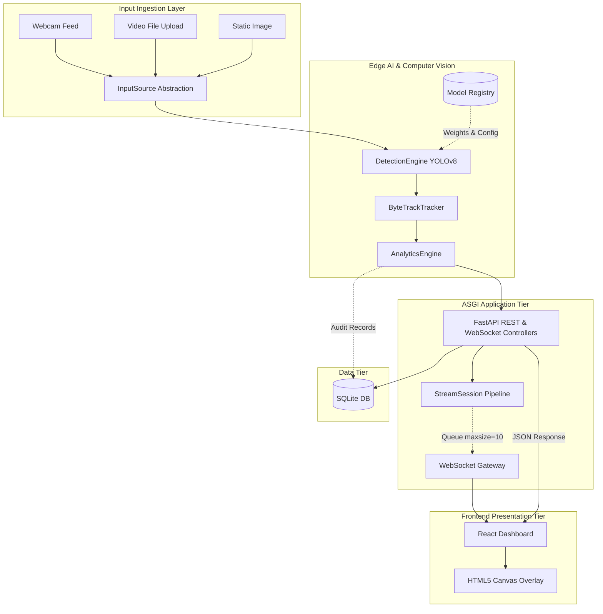

# System Architecture & Technical Design

## 1. Overview
The **Real-Time Object Detection and Tracking System** is architected as an end-to-end, enterprise-ready Computer Vision and Analytics platform. It bridges high-throughput edge AI inference with an asynchronous ASGI backend, an operational persistence tier, and a responsive frontend dashboard.

---

## 2. Layer Separation & Responsibilities

### 2.1 Computer Vision & Tracking Engine (`backend/app/services/vision/`)
- **Detector (`YOLODetector`):** Decoupled from HTTP controllers. Wraps YOLO with dynamic hardware selection (`cuda:0` / `cpu`), dynamic confidence thresholds, non-maximum suppression (NMS / IOU), and FP16 half-precision toggle.
- **Tracker (`ObjectTracker`):** Maintains persistent object IDs across frames using ByteTrack / BoT-SORT algorithms. Manages frame-by-frame centroid trajectories within bounded deques.

### 2.2 Analytics Engine (`backend/app/services/analytics/`)
- **Counter & Spatial Tripwire (`AnalyticsEngine`):** Tracks class frequencies, unique cumulative entities, active entities, and bidirectional line-crossing events using vector 2D line segment intersection calculations (`CCW` geometry).

### 2.3 Application & API Layer (`backend/app/api/`)
- **FastAPI Core (`backend/app/main.py`):** Configures application lifespan (database schema verification, warm-up inference), CORS, and centralized exception handling.
- **Schemas (`backend/app/api/schemas/`):** Strict Pydantic v2 schemas providing data validation and serialisation for bounding boxes, tracking frames, and analytics.
- **Endpoints (`backend/app/api/v1/endpoints/`):** Modular REST controllers (`/health`, `/detect/image`, `/track/frame`, `/analytics/summary`) and high-throughput bidirectional WebSocket endpoints (`/ws/stream`).

### 2.4 Database & Persistence (`backend/app/db/`)
- **SQLAlchemy 2.0 ORM:** Declarative models (`DetectionSession`, `DetectionRecord`, `TrackedObject`) supporting SQLite (or PostgreSQL in production) for auditability, telemetry, and analytics history.

### 2.5 Configuration & Logging (`backend/app/core/`, `configs/`)
- **Pydantic Settings (`Settings`):** Unified configuration reading from `.env` or system environment variables. Absolute path resolution anchored to project root, eliminating hard-coded paths.
- **Structured Logging:** Centralized logging with rotating file handlers (`logs/application.log`) and standard console output.

### 2.6 Streaming Service & WebSocket Layer (`backend/app/services/streaming/`)
- **WebSocket Manager (`WebSocketManager`):** Tracks and isolates active streaming sessions. Dispatches incoming client commands (`start`, `stop`, `pause`, `resume`, `ping`), protects against unhandled client disconnects, and manages session cleanup.
- **Stream Session (`StreamSession`):** Encapsulates the processing lifecycle for an individual client. Offloads camera/video I/O and GPU inference to threads (`asyncio.to_thread`) to maintain a non-blocking ASGI loop.
- **Backpressure Protection:** Implements bounded async queues (`asyncio.Queue(maxsize=10)`). Drops intermediate stale frames when slow clients cannot keep pace with inference throughput, preventing server memory bloat.

### 2.7 Dataset Pipeline Architecture (`data/datasets/`, `scripts/dataset/`)
- **Registry Tier (`data/datasets/registry/datasets.yaml`):** Authoritative YAML catalog tracking dataset IDs, task modalities, license terms, class taxonomies, and lifecycle statuses (`PLANNED`, `DOWNLOADING`, `DOWNLOADED`, `PROCESSED`, `VALIDATED`, `READY`).
- **Raw Storage Invariance (`data/datasets/raw/`):** Original downloads and annotations remain strictly immutable and isolated from downstream processing.
- **Normalized Processing (`data/datasets/processed/`):** Annotation converters translate native formats (e.g. VisDrone bounding boxes) into normalized YOLO coordinates `[cls cx cy nw nh]`, applying category remapping and ignored-region filtering.
- **Auditing & Leakage Safeguards (`scripts/dataset/validate_dataset.py`):** Automated validation calculates small-object pixel-area distributions, verifies coordinate bounds, and performs hash-based cross-split leakage checks across train, validation, and test partitions.

### 2.8 Model Management & Model Registry (`models/`, `backend/app/services/vision/model_manager.py`)
- **Declarative Registry (`models/registry/models.yaml`):** Authoritative catalog detailing model IDs, frameworks, recommended confidence/IoU thresholds, target input resolutions (`imgsz` 640 vs 1280), and physical availability (`AVAILABLE`, `LOADED`, `NOT_AVAILABLE`).
- **Pretrained & Custom Model Separation:** Cleanly segregates standard general-purpose checkpoints (`models/pretrained/`, `general_pretrained`) from domain-adapted aerial models (`models/custom/`, `custom_visdrone`).
- **Safe Dynamic Switching:** Validates weights files, checks file extensions (`.pt`, `.onnx`, `.engine`), updates active detection engine instances, and flushes CUDA memory (`torch.cuda.empty_cache()`) without server restarts.
- **Anti-Traversal Security:** Enforces boundary checks ensuring weight paths reside strictly within the project directory.

### 2.9 Frontend React Dashboard (`frontend/`)
- **Single-Page Application:** Built on React 18 and Vite, consuming backend REST and WebSocket APIs without hardcoded data.
- **Dynamic Bounding Box Canvas:** HTML5 Canvas overlay rendering bounding boxes, confidence tags, and persistent ByteTrack IDs synchronized to video frames.
- **Live Stream View (`LiveDetection.jsx`):** Bi-directional WebSocket stream client with start/stop/pause controls, hardware camera selector, and video file player.
- **Multi-Modal Workspaces:** Dedicated views for Image Detection (`ImageDetection.jsx`), Video File Analysis (`VideoDetection.jsx`), Spatial Analytics (`AnalyticsDashboard.jsx`), Model Registry Management (`ModelManagerView.jsx`), and System Diagnostics (`SettingsView.jsx`).
- **Zero-Polling Real-time Telemetry:** Receives instantaneous telemetry updates for FPS, inference latency, tracking latency, active tracks, cumulative counts, and tripwire events.

### 2.10 Security Architecture & Production Hardening (Step 13)
- **Path Traversal Defenses:** `Settings.resolve_safe_path()` rigorously verifies that all target paths resolve strictly within authorized boundaries (`PROJECT_ROOT`, `data/`, or `outputs/`), rejecting directory traversal (`..`), UNC network paths (`\\\\`), drive letters, and null bytes (`\x00`).
- **File Upload Safeguards:** Enforces strict MIME-type allowlists (`image/*`, `video/*`), maximum upload limits (15 MB for images, 50 MB for videos), and dimension checks (`MAX_IMAGE_DIMENSION = 8192px`) to prevent decompression bomb attacks (DoS).
- **WebSocket Protection & Concurrency Limits:** Strict payload size caps (`MAX_WS_MESSAGE_SIZE_BYTES = 64KB`), connection concurrency enforcement (`MAX_CONCURRENT_WS_SESSIONS = 10`), schema bounds validation, and clean hardware/task teardown on disconnect.
- **HTTP Security Headers Middleware:** Dispatches `X-Content-Type-Options: nosniff`, `X-Frame-Options: SAMEORIGIN`, `X-XSS-Protection: 1; mode=block`, and `Referrer-Policy: strict-origin-when-cross-origin` on all HTTP transactions.
- **Graceful Lifecycle Teardown:** Application shutdown hooks (`lifespan`) cleanly close all active streaming sessions (`stream_manager.close_all()`), release hardware camera devices, and cancel asynchronous worker loops.

### 2.11 Quality Assurance & Multi-Level Testing Architecture (Step 14)
- **Multi-Level Test Pyramid:** Spans 8 testing levels from fine-grained unit tests to live smoke tests:
  1. *Level 1 (Unit)*: Mathematical correctness, geometric intersection algorithms, tracker association, detector inference bounds, 1x1 / 2D grayscale frames, 0-byte file handling.
  2. *Level 2 (Integration)*: Pipeline handoffs between `InputSource`, `DetectionEngine`, `ByteTrackTracker`, and `AnalyticsEngine`.
  3. *Level 3 (REST API)*: Schema contracts, HTTP response codes (200, 400, 404, 413, 422), parameter validation, and safe error schemas without stack trace leakage.
  4. *Level 4 (WebSocket)*: Bi-directional stream state transitions, malformed payload recovery, rapid reconnects, and bounded frame queues.
  5. *Level 5 (Frontend)*: Component lifecycle, state machine transitions, telemetry calculation units, and clean production bundling.
  6. *Level 6 (E2E Integration)*: End-to-end integration across all active runtime subsystems.
  7. *Level 7 (Failure Injection)*: Graceful handling of corrupted files, missing models, unavailable cameras, and invalid configurations.
  8. *Level 8 (Smoke & Concurrency)*: Multi-threaded REST requests (ThreadPoolExecutor) and concurrent isolated WebSocket streaming sessions.
### 2.12 Performance Architecture & Optimization (Step 15)
- **Zero-Copy & Reduced Host-Device Transfers:** Bounding box coordinate extraction extracts all prediction components (`xyxy`, `conf`, `cls`) in a single contiguous PCIe memory copy via `res.boxes.data.cpu().numpy()`, eliminating multiple serialized GPU-to-CPU synchronization points.
- **Inference Mode Acceleration:** Detector inference runs inside `torch.inference_mode()`, disabling autograd tracking and tensor version counter updates, minimizing PyTorch overhead.
- **Native FP16 CUDA Quantization:** YOLO weights are natively converted to FP16 half-precision on CUDA devices (`self.model.model.half()`), boosting Tensor Core throughput on RTX architecture while eliminating deprecation warnings.
- **$O(1)$ Ring Buffer Tracking Trajectories:** Tracking trajectory history utilizes bounded deques (`collections.deque(maxlen=max_trajectory)`), transforming history eviction from $O(N)$ list shifts to $O(1)$ circular buffer appends.
- **Asynchronous Event-Loop Protection:** CPU-bound OpenCV annotations and JPEG compression are offloaded via `asyncio.to_thread()`, preventing blocking of the FastAPI ASGI event loop during high-throughput WebSocket streaming.
- **Zero Memory-Leak Guarantee:** Sustained video and stream sessions maintain flat VRAM footprints (0.00 MB leakage) and bounded RAM allocations with clean asynchronous task cancellation and hardware handle disposal.

### 2.13 Containerization & Deployment Architecture (Step 16)
- **Multi-Container Stack (`docker-compose.yml`):** Clean separation between FastAPI computer vision backend and Nginx-powered React SPA frontend.
- **Production Backend Container (`docker/backend.Dockerfile`):** Built on `python:3.11-slim-bookworm` with non-root security (`appuser`, UID 1000), OpenCV/PyTorch system libraries, healthcheck probes, and CPU/CUDA dependency modularity.
- **Multi-Stage Frontend Container (`docker/frontend.Dockerfile`):** Stage 1 compiles React 18 / Vite with locked dependencies (`node:20-alpine`), and Stage 2 serves the static bundle via lightweight Nginx Alpine (`nginx:1.27-alpine`), reducing production image size and eliminating Node.js runtime vulnerabilities.
- **Nginx Reverse Proxy & WebSocket Gateway (`docker/nginx.conf`):** Unifies REST API routing (`/api/v1/`), WebSocket upgrade negotiation (`/ws/stream` with 3600s timeouts and unbuffered streaming), SPA client-side routing fallback, and client upload payload boundaries (60 MB).
- **Persistent Storage Volumes:** Decoupled storage for SQLite audit logs and uploads (`vision-backend-data`), output artifacts (`vision-backend-outputs`), and runtime logs (`vision-backend-logs`), complemented by host bind mounts for the model registry and weights.
- **NVIDIA GPU Acceleration Overlay (`docker-compose.gpu.yml`):** Composable override utilizing NVIDIA Container Toolkit for zero-code CUDA enablement on GPU-equipped hosts.

---

## 3. Data Flow

### Live Streaming Pipeline (`/api/v1/ws/stream`):
1. Client connects and receives `connection_ack` with a unique `session_id`.
2. Client transmits `{"action": "start", "source": "video"|"webcam", ...}`.
3. `StreamSession` validates the source (preventing path traversal), opens `VideoInput` or `WebcamInput`, and starts the async sender and processing workers.
4. For each frame at the configured `fps_limit`:
   - `input_source.read()` captures frame.
   - `DetectionEngine` generates structured detections on `cuda:0`.
   - `ByteTrackTracker` performs two-stage association, assigning persistent IDs.
   - `AnalyticsEngine` updates active/cumulative counts, line tripwires, and ROI dwell times.
   - Structured `frame_result` message is enqueued and streamed over the WebSocket.
5. Client issues `{"action": "stop"}` or disconnects; `StreamSession` safely releases hardware cameras or video capture handles, cancels background tasks, and flushes queues.

